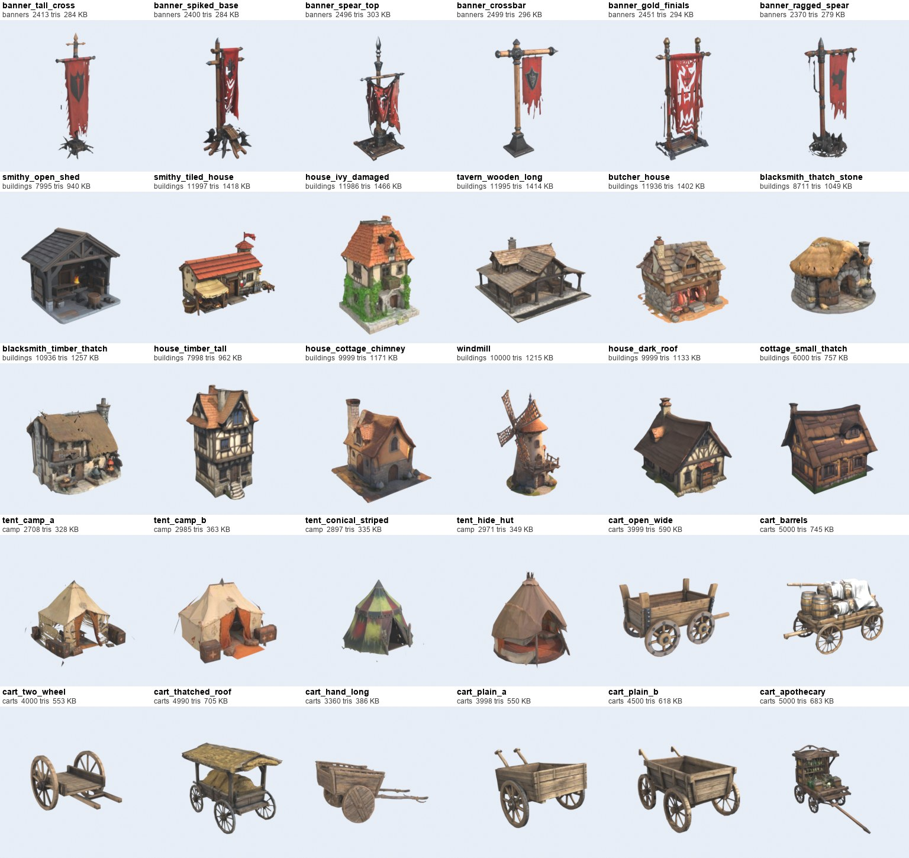

# Meshy free community pack (CC0), optimized

Mobile-ready GLBs made from 212 CC0 models of the Meshy community library. Triage: `docs/art/meshy_free_triage.md`. Licence: `kingdom/assets/incoming/meshy_free/CREDITS.md`.
These are **not placed in any level yet**. They sit in `kingdom/assets/incoming/meshy_free/` waiting to be wired in.

## What is in the folder

- `<category>/<name>_lod0.glb`: single mesh, one baked texture (512 or 1024 px JPEG), metallic 0, roughness 0.9, Y-up, origin at bottom-centre, real-world scale (house 6-9 m, chest 0.9 m, goblin 1.3 m).
- `<category>/<name>_lod1.glb`: about 30 percent of LOD0 triangles with a half-size texture (buildings, castle, churches, big trees).
- `maybe/<category>/`: MAYBE-tier statics (off-tone, sparse, baked ground discs). Usable but check them first.
- Humanoids (knights, villagers, T-posed goblins) were not optimized: they need rigging and a paint pass.

Pipeline: `tools/meshy/optimize_free.py` (voxel remesh, decimate, Cycles diffuse bake; `solid` variant closes thin cloth/leaf sheets first, `dec` variant skips the remesh). Thumbnails: `tools/meshy/batch_thumbs.py`.

## Contact sheets

- Raw triage: `docs/art/meshy_free/contact_sheets/raw_1.jpg` .. `raw_8.jpg`
- Optimized set: `docs/art/meshy_free/contact_sheets/optimized_1.jpg` .. `optimized_7.jpg`
- Before/after (raw left, LOD0 right): `docs/art/meshy_free/before_after/ba_sample_*.jpg`, LOD chains `lods_*.png`

## Categories

| category | LOD0 count | tris range | description |
|---|---:|---|---|
| banners | 6 | 2,370 - 2,499 | Banner poles (3.5 m) |
| buildings | 12 | 6,000 - 11,997 | Houses, smithies, taverns, windmill (6-9 m) |
| camp | 4 | 2,708 - 2,985 | Tents |
| carts | 10 | 3,360 - 6,977 | Carts and wagons |
| castle | 12 | 7,990 - 15,000 | Gates, towers, keeps (8-20 m) |
| churches | 10 | 6,989 - 12,000 | Churches and chapels |
| creatures | 14 | 5,998 - 7,981 | Wolves, goblins, dragons, spirit fox, treant, horse (static meshes, no rig) |
| furniture | 6 | 1,998 - 3,000 | Chairs |
| magic | 20 | 1,982 - 5,973 | Crystals, orbs, runestones, portals |
| market | 15 | 3,834 - 5,059 | Market stalls (3-4 m wide) |
| nature | 12 | 1,500 - 6,000 | Trees and rocks |
| props | 20 | 1,485 - 3,995 | Chests, wells, cannon, altar, barrels, shield |
| ruins | 12 | 2,978 - 6,235 | Mossy ruin walls, arches, pillars |
| maybe/* | 28 | 1,996 - 15,000 | MAYBE tier statics |

## Models

### banners

`banner_crossbar` (2,499), `banner_gold_finials` (2,451), `banner_ragged_spear` (2,370), `banner_spear_top` (2,496), `banner_spiked_base` (2,400), `banner_tall_cross` (2,413)

### buildings

`blacksmith_thatch_stone` (8,711), `blacksmith_timber_thatch` (10,936), `butcher_house` (11,936), `cottage_small_thatch` (6,000), `house_cottage_chimney` (9,999), `house_dark_roof` (9,999), `house_ivy_damaged` (11,986), `house_timber_tall` (7,998), `smithy_open_shed` (7,995), `smithy_tiled_house` (11,997), `tavern_wooden_long` (11,995), `windmill` (10,000)

### camp

`tent_camp_a` (2,708), `tent_camp_b` (2,985), `tent_conical_striped` (2,897), `tent_hide_hut` (2,971)

### carts

`cart_apothecary` (5,000), `cart_barrels` (5,000), `cart_cargo_spoke` (3,998), `cart_hand_long` (3,360), `cart_open_wide` (3,999), `cart_plain_a` (3,998), `cart_plain_b` (4,500), `cart_thatched_roof` (4,990), `cart_two_wheel` (4,000), `wagon_covered` (6,977)

### castle

`castle_sandstone_a` (14,783), `castle_sandstone_b` (14,997), `gate_dark_towers` (11,998), `gate_small_towers` (9,980), `gate_twin_towers_blue` (11,999), `gate_wall_ivy` (11,987), `gate_wall_long` (11,995), `keep_small_on_plinth` (15,000), `tower_octagon_wall` (8,000), `tower_pink_flag` (7,997), `tower_round` (7,990), `tower_square_small` (9,999)

### churches

`chapel_island_small` (7,421), `chapel_stone_small` (6,989), `chapel_tan_tiled` (8,993), `church_dark_small` (9,000), `church_gothic_red` (11,996), `church_old_brick` (8,991), `church_spire_small` (11,996), `church_spire_tan` (12,000), `church_stone_island` (9,819), `church_white_red_spire` (12,000)

### creatures

`dragon_fire_small` (6,000), `dragon_green_armored` (7,981), `goblin_a` (6,998), `goblin_armored` (6,977), `goblin_b` (6,998), `goblin_knife` (6,977), `goblin_ragged` (6,943), `horse_saddled` (7,962), `spirit_fox_blue` (6,000), `treant_forest` (6,996), `wolf_brown` (5,999), `wolf_dark` (6,000), `wolf_ghost` (6,000), `wolf_grey` (5,998)

### furniture

`chair_armchair_wood` (2,500), `chair_gothic_tall` (3,000), `chair_high_back` (2,500), `chair_ornate_red` (3,000), `chair_simple_a` (1,998), `chair_simple_b` (2,000)

### magic

`crystal_blue_pedestal` (1,998), `crystal_cyan_pedestal` (2,000), `crystal_egg_purple` (1,998), `crystal_green_pedestal_a` (1,999), `crystal_green_pedestal_b` (1,999), `crystal_green_pedestal_c` (2,000), `crystal_ice_shard` (2,000), `crystal_purple_pedestal` (2,000), `crystal_red_pedestal` (1,982), `orb_purple_roots` (2,496), `orb_red_stand` (2,000), `portal_blue_arch` (4,983), `portal_dark_purple` (5,000), `portal_elf_mound` (4,994), `portal_ice_arch` (3,867), `portal_vine_arch` (5,973), `runestone_carved_red` (3,998), `runestone_ember` (5,000), `runestone_face_moss` (3,000), `runestone_verdant` (2,998)

### market

`shed_striped_awning` (4,994), `stall_apples` (5,059), `stall_awning_red` (4,847), `stall_blue_shields` (4,975), `stall_cheese_awning` (4,952), `stall_crates_cream` (4,395), `stall_fruit_cream` (4,930), `stall_market_sign_red` (4,335), `stall_meat_shingle` (4,876), `stall_open_roof` (3,992), `stall_potatoes` (5,040), `stall_potion` (4,985), `stall_red_awning_goods` (3,834), `stall_small_workshop` (3,998), `stall_striped_shields` (4,984)

### maybe/banners

`banner_drow_purple` (2,459)

### maybe/buildings

`village_block_a` (14,989), `village_block_b` (14,522), `village_block_c` (14,997), `village_cluster_cobble` (14,992), `village_path_scene` (15,000), `village_scene_small_houses` (15,000)

### maybe/camp

`tent_white_thin` (2,887)

### maybe/castle

`arch_door_on_tile` (4,995)

### maybe/creatures

`dragon_crystal_lying` (3,989), `gargoyle_demonic` (5,994), `gargoyle_winged_a` (5,988), `gargoyle_winged_b` (5,996), `hellhound_grey` (5,998), `hellhound_lava` (5,998), `werewolf_statue` (6,982), `wolf_realistic_sitting` (5,999)

### maybe/magic

`portal_heart_glow` (5,000), `portal_victorian_scifi` (4,998), `relic_crystal_ornament` (1,996), `relic_purple_mirror` (2,487), `relic_red_brooch_flat` (2,000), `relic_red_gem_ring` (2,000), `runestone_neon` (5,000)

### maybe/nature

`tree_old_grass_disc` (5,943), `tree_old_orange_disc` (5,987), `tree_old_sparse` (5,887)

### maybe/props

`wheel_barrels_pile` (2,987)

### nature

`rock_blue_brown` (2,000), `rock_blue_crystal` (2,000), `rock_grey_plain` (1,500), `rock_limestone_tall` (2,498), `rocks_mossy_mushroom` (2,500), `tree_cartoon_green_a` (5,997), `tree_cartoon_green_b` (4,101), `tree_old_a` (5,973), `tree_old_b` (6,000), `tree_old_rocks` (5,882), `tree_old_twisted` (4,996), `tree_pine` (3,999)

### props

`altar_stone_slab` (1,999), `barrels_crates_stack` (3,000), `cannon_wooden` (3,000), `chest_blue_iron` (1,500), `chest_copper_lock` (1,500), `chest_dark_iron` (1,499), `chest_gold` (1,500), `chest_iron_box` (1,500), `chest_metal_wood` (1,500), `chest_orange_metal` (1,500), `chest_orange_riveted` (1,500), `chest_orange_wood` (1,485), `chest_pink` (1,500), `chest_red_black` (1,500), `chest_silver_lock` (1,500), `shield_dragon_heraldic` (2,498), `well_covered_planks` (3,995), `well_stone_roofed` (2,491), `well_stone_shingle` (2,500), `well_wood_roof` (2,485)

### ruins

`arch_baroque_old` (6,235), `arch_dark_pedestal` (3,914), `pillar_mossy_a` (2,978), `pillar_mossy_b` (3,000), `ruin_arch_pillars` (4,974), `ruin_arch_side` (5,000), `ruin_arch_wall` (5,000), `ruin_gazebo` (5,000), `ruin_pergola` (4,998), `ruin_wall_broken_a` (5,000), `ruin_wall_broken_b` (5,000), `ruin_wall_corner` (5,000)

## Known limits

- Baked diffuse only: no emissive glow on crystals/portals (add in Godot if wanted). Solid-colour roughness.
- Several buildings and castles carry a small ground plinth/base from the source model.
- `ruins/arch_baroque_old` and a few thin cloth/roof details are slightly ragged; they read fine at game distance.
- Textures are painted for a neutral light; some pieces (grey towers, dark ruins) are duller than the reference and want a warm tint or colour grade.
