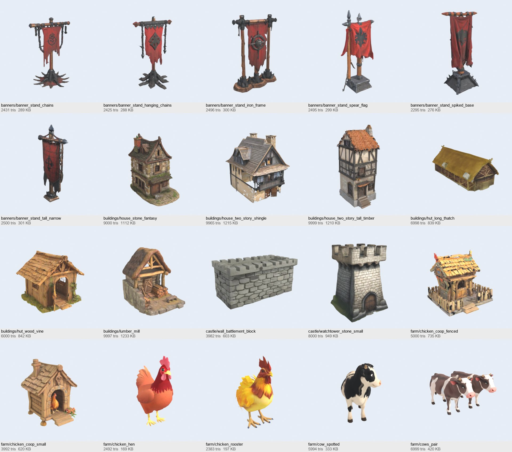

# Meshy free community pack (CC0), optimized

Mobile-ready GLBs made from 373 CC0 models of the Meshy community library (round 1: 212, round 2: 161, see the last section). Triage: `docs/art/meshy_free_triage.md`. Licence: `kingdom/assets/incoming/meshy_free/CREDITS.md`.
These are **not placed in any level yet**. They sit in `kingdom/assets/incoming/meshy_free/` waiting to be wired in.

## What is in the folder

- `<category>/<name>_lod0.glb`: single mesh, one baked texture (512 or 1024 px JPEG), metallic 0, roughness 0.9, Y-up, origin at bottom-centre, real-world scale (house 6-9 m, chest 0.9 m, goblin 1.3 m).
- `<category>/<name>_lod1.glb`: about 30 percent of LOD0 triangles with a half-size texture (buildings, castle, churches, big trees).
- `maybe/<category>/`: MAYBE-tier statics (off-tone, sparse, baked ground discs). Usable but check them first.
- Humanoids (knights, villagers, T-posed goblins) were not optimized: they need rigging and a paint pass.

Pipeline: `tools/meshy/optimize_free.py` (voxel remesh, decimate, Cycles diffuse bake; `solid` variant closes thin cloth/leaf sheets first, `dec` variant skips the remesh). Thumbnails: `tools/meshy/batch_thumbs.py`.

## Contact sheets

- Raw triage: `docs/art/meshy_free/contact_sheets/raw_1.jpg` .. `raw_8.jpg`
- Optimized set: `docs/art/meshy_free/contact_sheets/optimized_1.jpg` .. `optimized_7.jpg`
- Before/after (raw left, LOD0 right): `docs/art/meshy_free/before_after/ba_sample_*.jpg`, LOD chains `lods_*.png`

## Categories

| category | LOD0 count | tris range | description |
|---|---:|---|---|
| banners | 6 | 2,370 - 2,499 | Banner poles (3.5 m) |
| buildings | 12 | 6,000 - 11,997 | Houses, smithies, taverns, windmill (6-9 m) |
| camp | 4 | 2,708 - 2,985 | Tents |
| carts | 10 | 3,360 - 6,977 | Carts and wagons |
| castle | 12 | 7,990 - 15,000 | Gates, towers, keeps (8-20 m) |
| churches | 10 | 6,989 - 12,000 | Churches and chapels |
| creatures | 14 | 5,998 - 7,981 | Wolves, goblins, dragons, spirit fox, treant, horse (static meshes, no rig) |
| furniture | 6 | 1,998 - 3,000 | Chairs |
| magic | 20 | 1,982 - 5,973 | Crystals, orbs, runestones, portals |
| market | 15 | 3,834 - 5,059 | Market stalls (3-4 m wide) |
| nature | 12 | 1,500 - 6,000 | Trees and rocks |
| props | 20 | 1,485 - 3,995 | Chests, wells, cannon, altar, barrels, shield |
| ruins | 12 | 2,978 - 6,235 | Mossy ruin walls, arches, pillars |
| maybe/* | 28 | 1,996 - 15,000 | MAYBE tier statics |

## Models

### banners

`banner_crossbar` (2,499), `banner_gold_finials` (2,451), `banner_ragged_spear` (2,370), `banner_spear_top` (2,496), `banner_spiked_base` (2,400), `banner_tall_cross` (2,413)

### buildings

`blacksmith_thatch_stone` (8,711), `blacksmith_timber_thatch` (10,936), `butcher_house` (11,936), `cottage_small_thatch` (6,000), `house_cottage_chimney` (9,999), `house_dark_roof` (9,999), `house_ivy_damaged` (11,986), `house_timber_tall` (7,998), `smithy_open_shed` (7,995), `smithy_tiled_house` (11,997), `tavern_wooden_long` (11,995), `windmill` (10,000)

### camp

`tent_camp_a` (2,708), `tent_camp_b` (2,985), `tent_conical_striped` (2,897), `tent_hide_hut` (2,971)

### carts

`cart_apothecary` (5,000), `cart_barrels` (5,000), `cart_cargo_spoke` (3,998), `cart_hand_long` (3,360), `cart_open_wide` (3,999), `cart_plain_a` (3,998), `cart_plain_b` (4,500), `cart_thatched_roof` (4,990), `cart_two_wheel` (4,000), `wagon_covered` (6,977)

### castle

`castle_sandstone_a` (14,783), `castle_sandstone_b` (14,997), `gate_dark_towers` (11,998), `gate_small_towers` (9,980), `gate_twin_towers_blue` (11,999), `gate_wall_ivy` (11,987), `gate_wall_long` (11,995), `keep_small_on_plinth` (15,000), `tower_octagon_wall` (8,000), `tower_pink_flag` (7,997), `tower_round` (7,990), `tower_square_small` (9,999)

### churches

`chapel_island_small` (7,421), `chapel_stone_small` (6,989), `chapel_tan_tiled` (8,993), `church_dark_small` (9,000), `church_gothic_red` (11,996), `church_old_brick` (8,991), `church_spire_small` (11,996), `church_spire_tan` (12,000), `church_stone_island` (9,819), `church_white_red_spire` (12,000)

### creatures

`dragon_fire_small` (6,000), `dragon_green_armored` (7,981), `goblin_a` (6,998), `goblin_armored` (6,977), `goblin_b` (6,998), `goblin_knife` (6,977), `goblin_ragged` (6,943), `horse_saddled` (7,962), `spirit_fox_blue` (6,000), `treant_forest` (6,996), `wolf_brown` (5,999), `wolf_dark` (6,000), `wolf_ghost` (6,000), `wolf_grey` (5,998)

### furniture

`chair_armchair_wood` (2,500), `chair_gothic_tall` (3,000), `chair_high_back` (2,500), `chair_ornate_red` (3,000), `chair_simple_a` (1,998), `chair_simple_b` (2,000)

### magic

`crystal_blue_pedestal` (1,998), `crystal_cyan_pedestal` (2,000), `crystal_egg_purple` (1,998), `crystal_green_pedestal_a` (1,999), `crystal_green_pedestal_b` (1,999), `crystal_green_pedestal_c` (2,000), `crystal_ice_shard` (2,000), `crystal_purple_pedestal` (2,000), `crystal_red_pedestal` (1,982), `orb_purple_roots` (2,496), `orb_red_stand` (2,000), `portal_blue_arch` (4,983), `portal_dark_purple` (5,000), `portal_elf_mound` (4,994), `portal_ice_arch` (3,867), `portal_vine_arch` (5,973), `runestone_carved_red` (3,998), `runestone_ember` (5,000), `runestone_face_moss` (3,000), `runestone_verdant` (2,998)

### market

`shed_striped_awning` (4,994), `stall_apples` (5,059), `stall_awning_red` (4,847), `stall_blue_shields` (4,975), `stall_cheese_awning` (4,952), `stall_crates_cream` (4,395), `stall_fruit_cream` (4,930), `stall_market_sign_red` (4,335), `stall_meat_shingle` (4,876), `stall_open_roof` (3,992), `stall_potatoes` (5,040), `stall_potion` (4,985), `stall_red_awning_goods` (3,834), `stall_small_workshop` (3,998), `stall_striped_shields` (4,984)

### maybe/banners

`banner_drow_purple` (2,459)

### maybe/buildings

`village_block_a` (14,989), `village_block_b` (14,522), `village_block_c` (14,997), `village_cluster_cobble` (14,992), `village_path_scene` (15,000), `village_scene_small_houses` (15,000)

### maybe/camp

`tent_white_thin` (2,887)

### maybe/castle

`arch_door_on_tile` (4,995)

### maybe/creatures

`dragon_crystal_lying` (3,989), `gargoyle_demonic` (5,994), `gargoyle_winged_a` (5,988), `gargoyle_winged_b` (5,996), `hellhound_grey` (5,998), `hellhound_lava` (5,998), `werewolf_statue` (6,982), `wolf_realistic_sitting` (5,999)

### maybe/magic

`portal_heart_glow` (5,000), `portal_victorian_scifi` (4,998), `relic_crystal_ornament` (1,996), `relic_purple_mirror` (2,487), `relic_red_brooch_flat` (2,000), `relic_red_gem_ring` (2,000), `runestone_neon` (5,000)

### maybe/nature

`tree_old_grass_disc` (5,943), `tree_old_orange_disc` (5,987), `tree_old_sparse` (5,887)

### maybe/props

`wheel_barrels_pile` (2,987)

### nature

`rock_blue_brown` (2,000), `rock_blue_crystal` (2,000), `rock_grey_plain` (1,500), `rock_limestone_tall` (2,498), `rocks_mossy_mushroom` (2,500), `tree_cartoon_green_a` (5,997), `tree_cartoon_green_b` (4,101), `tree_old_a` (5,973), `tree_old_b` (6,000), `tree_old_rocks` (5,882), `tree_old_twisted` (4,996), `tree_pine` (3,999)

### props

`altar_stone_slab` (1,999), `barrels_crates_stack` (3,000), `cannon_wooden` (3,000), `chest_blue_iron` (1,500), `chest_copper_lock` (1,500), `chest_dark_iron` (1,499), `chest_gold` (1,500), `chest_iron_box` (1,500), `chest_metal_wood` (1,500), `chest_orange_metal` (1,500), `chest_orange_riveted` (1,500), `chest_orange_wood` (1,485), `chest_pink` (1,500), `chest_red_black` (1,500), `chest_silver_lock` (1,500), `shield_dragon_heraldic` (2,498), `well_covered_planks` (3,995), `well_stone_roofed` (2,491), `well_stone_shingle` (2,500), `well_wood_roof` (2,485)

### ruins

`arch_baroque_old` (6,235), `arch_dark_pedestal` (3,914), `pillar_mossy_a` (2,978), `pillar_mossy_b` (3,000), `ruin_arch_pillars` (4,974), `ruin_arch_side` (5,000), `ruin_arch_wall` (5,000), `ruin_gazebo` (5,000), `ruin_pergola` (4,998), `ruin_wall_broken_a` (5,000), `ruin_wall_broken_b` (5,000), `ruin_wall_corner` (5,000)

## Known limits

- Baked diffuse only: no emissive glow on crystals/portals (add in Godot if wanted). Solid-colour roughness.
- Several buildings and castles carry a small ground plinth/base from the source model.
- `ruins/arch_baroque_old` and a few thin cloth/roof details are slightly ragged; they read fine at game distance.
- Textures are painted for a neutral light; some pieces (grey towers, dark ruins) are duller than the reference and want a warm tint or colour grade.

## Round 2: street dressing and props (126 KEEP + 19 MAYBE statics)

161 more CC0 models, triage in `docs/art/meshy_free_triage.md` (section "Round 2"). Same pipeline and conventions as above. New categories: `lighting`, `signs`, `fences`, `farm`, `flora`, `water`, `interior`, `loot`. No rigs in this batch, so the 12 humanoid MAYBEs (villagers, knights, archers) are still not optimized.

Contact sheets: raw `contact_sheets/raw2_1.jpg` .. `raw2_9.jpg`, optimized `contact_sheets/optimized_r2_1.jpg` .. `optimized_r2_8.jpg`. Before/after (raw left, LOD0 right): `before_after/ba_r2_1.jpg` .. `ba_r2_4.jpg` (26 samples).

| category | LOD0 count | tris range | description |
|---|---:|---|---|
| banners (round 2) | 6 | 2,295 - 2,500 | Banner stands (3.5 m) |
| buildings (round 2) | 6 | 6,000 - 9,999 | Huts, houses, lumber mill (3.5-9 m) |
| castle (round 2) | 2 | 3,982 - 8,000 | Watchtower, battlement block |
| farm (round 2) | 15 | 1,372 - 6,999 | Wheelbarrows, hay bales, cows, chickens, coops, sheds |
| fences (round 2) | 15 | 1,500 - 3,000 | Rail, picket, palisade, wattle fences and gates (2 m sections) |
| flora (round 2) | 12 | 1,307 - 3,938 | Bouquets, mushrooms, bellflower, bush, tree stumps |
| furniture (round 2) | 14 | 1,800 - 4,000 | Thrones, tavern tables and benches, lectern |
| interior (round 2) | 11 | 2,000 - 4,997 | Bookshelves, weapon racks, bed, armour stand, tapestry, wall shields |
| lighting (round 2) | 19 | 1,200 - 3,365 | Street lamps, lanterns, torches, wall sconces, candle |
| loot (round 2) | 2 | 999 - 1,000 | Big coins |
| props (round 2) | 5 | 1,200 - 1,998 | Crate, kegs, axes |
| signs (round 2) | 3 | 1,434 - 2,500 | Hanging shop signs |
| water (round 2) | 16 | 2,497 - 5,000 | Bridges, docks, boats |
| maybe/* (round 2) | 19 | 1,500 - 8,977 | off-tone statics: ruined huts, brutes, skeletons, grey dragon, dark shields, Victorian lamp |

### Round 2 models

#### banners

`banner_stand_chains` (2,431), `banner_stand_hanging_chains` (2,425), `banner_stand_iron_frame` (2,496), `banner_stand_spear_flag` (2,495), `banner_stand_spiked_base` (2,295), `banner_stand_tall_narrow` (2,500)

#### buildings

`house_stone_fantasy` (9,000), `house_two_story_shingle` (9,965), `house_two_story_tall_timber` (9,999), `hut_long_thatch` (6,998), `hut_wood_vine` (6,000), `lumber_mill` (9,997)

#### castle

`wall_battlement_block` (3,982), `watchtower_stone_small` (8,000)

#### farm

`chicken_coop_fenced` (5,000), `chicken_coop_small` (3,992), `chicken_hen` (2,492), `chicken_rooster` (2,383), `cow_spotted` (5,994), `cows_pair` (6,999), `hay_bale_lowpoly` (1,494), `hay_bale_rect_a` (1,372), `hay_bale_round` (1,789), `hay_bale_yellow_large` (4,574), `shed_plank_low` (3,976), `shed_thatch_small` (3,984), `shed_wood_shingle` (3,997), `wheelbarrow_planter` (3,898), `wheelbarrow_wooden_old` (4,499)

#### fences

`fence_board_gate` (2,500), `fence_board_panel` (2,000), `fence_broken_rail` (2,500), `fence_farm_white` (2,979), `fence_gate_rail` (1,798), `fence_palisade` (2,993), `fence_picket_low` (2,500), `fence_picket_tall` (3,000), `fence_plank_panel` (2,500), `fence_rail_grass_a` (1,886), `fence_rail_grass_b` (1,833), `fence_rail_orange` (1,500), `fence_rail_rustic` (2,000), `fence_woven_wattle` (2,985), `wall_stone_railing` (3,000)

#### flora

`bellflower_purple` (2,320), `bouquet_bright` (2,000), `bouquet_wild` (2,000), `bush_raspberry` (3,938), `mushroom_bowl_orange` (2,500), `mushroom_brown` (1,500), `mushroom_glow_brown` (1,992), `mushroom_redcap` (1,307), `mushrooms_blue_glow` (2,500), `stump_cut` (2,500), `stump_dead_tall` (2,999), `stump_grass_rocks` (2,675)

#### furniture

`lectern_desk` (2,500), `table_barrel_top` (1,800), `table_bench_tavern` (3,000), `table_tavern_feast` (2,997), `table_tavern_thick` (2,000), `table_tavern_trestle` (2,052), `tavern_set_barrels_a` (3,987), `tavern_set_barrels_b` (4,000), `throne_carved_wood` (3,000), `throne_dark_red_studded` (3,000), `throne_gold_red` (3,497), `throne_gothic_gold` (3,491), `throne_leather_cushion` (2,500), `throne_red_gothic` (2,999)

#### interior

`armour_stand_knight` (4,997), `bed_canopy_red` (4,493), `bookshelf_glass_cabinet` (2,999), `bookshelf_tall_rustic` (3,490), `bookshelf_wide_low` (3,229), `shelf_weapons_display` (3,485), `tapestry_hunt` (2,000), `wall_shield_heater` (2,500), `wall_shield_iron_studded` (2,500), `weapon_rack_swords` (3,471), `weapon_racks_spears` (4,000)

#### lighting

`candle_stand` (1,200), `lamp_post_purple_bracket` (2,845), `lamp_post_timber_cross` (2,997), `lantern_hanging_blue` (3,365), `lantern_hanging_green` (1,500), `lantern_post_purple` (2,481), `lantern_post_wood` (2,998), `lantern_wall_iron` (1,998), `lantern_wall_scroll` (2,413), `sconce_torch_bracket` (1,496), `sconce_torch_ornate` (1,998), `sconce_wall_bowl_a` (1,800), `sconce_wall_bowl_b` (1,778), `street_lamp_twin_gold` (3,000), `street_lantern_gothic` (2,995), `street_lantern_whimsical` (2,500), `torch_dungeon_cage` (2,279), `torch_hand_silver` (1,496), `torch_stake` (1,499)

#### loot

`coin_gold_big` (1,000), `coin_silver_big` (999)

#### props

`axe_battle_upright` (1,500), `axe_long_handle` (1,500), `crate_planks` (1,200), `keg_iron_banded_side` (1,998), `keg_iron_banded_upright` (1,997)

#### signs

`sign_blank_bracket` (2,500), `sign_blank_rope` (1,434), `sign_shop_lion` (2,496)

#### water

`boat_longship_sail` (4,500), `boat_rowing` (3,000), `bridge_arch_pale` (3,500), `bridge_garden_vines` (3,500), `bridge_mossy_small` (3,000), `bridge_old_stone_blue` (3,500), `bridge_serenity_steps` (4,992), `bridge_stone_arched_rail` (5,000), `bridge_stone_dark_long` (4,000), `bridge_stone_passage` (3,937), `bridge_stone_rustic_a` (3,500), `bridge_stone_rustic_b` (4,000), `bridge_stone_rustic_c` (4,000), `bridge_stone_wood_deck` (4,000), `dock_circular_wood` (2,497), `dock_weathered_pier` (3,996)

#### maybe/buildings

`hut_hunter_base` (6,415), `hut_mossy_ruined_a` (7,963), `hut_mossy_ruined_b` (8,977)

#### maybe/creatures

`brute_horned_a` (6,975), `brute_horned_b` (6,945), `brute_skull_shoulders` (6,984), `dragon_grey_small` (5,976), `skeleton_hooded` (6,500), `skeleton_warrior_a` (6,500), `skeleton_warrior_b` (6,488)

#### maybe/fences

`fence_picket_thin_long` (2,995)

#### maybe/furniture

`table_dining_walnut` (2,000)

#### maybe/interior

`armour_knight_sword_static` (5,993), `bookshelf_nook_corner` (3,489), `wall_shield_tall_dark` (2,500), `weapon_rack_round_shield` (3,500)

#### maybe/lighting

`street_lamp_victorian` (2,998)

#### maybe/props

`mace_iron` (1,500)

#### maybe/water

`bridge_arch_long_rocks` (4,990)

### Round 2 notes and limits

- Buildings (round 2) and `castle/watchtower_stone_small` also have `_lod1.glb`.
- `dec` variant (no voxel remesh) was needed for open, thin-shelled sources: both bouquets, `house_stone_fantasy`, `house_two_story_tall_timber` (roof stays ragged), `hut_wood_vine`, `chicken_coop_fenced`, `stump_dead_tall`, `throne_leather_cushion`, `skeleton_hooded`, `skeleton_warrior_a`. `solid` fixed `lamp_post_timber_cross`, `lumber_mill`, `tavern_set_barrels_a` and the cloth/thin items. Per-model variants are listed in `tools/meshy/free_batch/spec_r2.py`.
- Rough at close range: `flora/bouquet_*`, `flora/bush_raspberry`, `farm/hay_bale_yellow_large` (faceted), `torch_dungeon_cage` (a few stray flame fragments), `hut_mossy_ruined_*` (ground fringe shreds remain; the floating debris above the roofs was removed, see Fixes).
- Lighting pieces carry no light: glass and flame are baked colour only, add OmniLight and emissive in Godot.
- Coins are scaled to 0.25 m as pickups, not real size.
- Several thrones, lamps and sconces are darker and more metallic than the reference; they want the warm grade.
- Driver: `ROUND=2 python tools/meshy/free_batch/run_opt.py [idx[:variant] ...]` (staging paths are hard-coded, see `tools/meshy/free_batch/README.md`).

## Rigged farm animals (`farm/rigged/`)

Static farm meshes were rigged and animated in Blender (`tools/meshy/animal_rig/`). All GLBs keep the single baked texture, face -Z in Godot (glTF +Z), stand on y = 0 and use real-world size.

| file | bones | tris | clips (30 fps) | walk speed |
|---|---:|---:|---|---:|
| `chicken_hen_rigged.glb` | 11 | 2,492 | `idle` 96 f, `walk` 20 f, `eat` (2 pecks) 60 f, `flap` (3 flaps, hops) 30 f | 0.28 m/s |
| `chicken_rooster_rigged.glb` (hen x 1.2) | 11 | 2,383 | same four | 0.33 m/s |
| `cow_spotted_rigged.glb` | 21 | 5,994 | `idle` 120 f, `walk` 42 f, `eat` (graze, 150 f) | 0.63 m/s |
| `cow_brown_a_rigged.glb`, `cow_brown_b_rigged.glb` (split from `cows_pair`) | 21 | about 3,500 each | same three | 0.71 m/s |

- Each `.json` next to a GLB holds bone count, clip lengths and the walk speed. Move the animal at that speed while `walk` plays: stance feet then stay planted (feet are solved with analytic two-bone IK per frame, hooves counter-rotated, so ground contact is exact by construction).
- Clips are baked keyframes on an NLA track per name (`idle`, `walk`, `eat`, `flap`), first frame == last frame. In Godot set `loop_mode = LOOP_LINEAR` on all four (chicken `eat` and cow `eat` are complete sequences that start and end upright).
- Weights: Blender automatic weights (bone heat) computed on a voxel-remeshed watertight proxy (the raw meshes are hundreds of loose feather and hair shells, bone heat fails on them directly), transferred to the real mesh, then fixed by rule: legs only inside their leg column, wings only on the flank patch, rear feathers and the low dangling feather off the wings, tail only at the tail, ears only near the ear bones, verts behind the neck pivot never follow the neck, head/muzzle/horns/hair tuft belong to the head.
- Cows are aligned on import (body axis to Y from the feet), so the split cows and the spotted cow all face -Y. The pair mesh was split by connectivity (two cows, x < 0 and x >= 0).
- Not rigged (no time): horse, wolves, fox, dragons. `rig_cow.py` is written for cow proportions; the same `rig_lib.py` (skeleton, proxy skinning, IK, clip export) applies.
- Review sheets (Blender EEVEE on a checker floor that the animal walks over): `docs/art/meshy_free/rigged/<animal>_<clip>[_side|_front]/sheet_*.png` + `motion.png`. Re-render with `tools/meshy/animal_rig/review.sh <glb> <name> <clip> <speed> <3q|side|front> <step> <px>`.
- Known limits: the cow grazing pose bends the whole front (about 20 degrees) because the head is short, the muzzle stops about 20 cm above the ground; wing flapping on the chickens is stiff (the wings are texture patches on the body, so they swing out as flat plates); the rooster's small orange tail spike follows the tail bone.

## Fixes after round 2 (`fixes/`)

- Re-baked earlier (see `docs/STATUS_LOCAL.md`): `lamp_post_purple_bracket`, `torch_dungeon_cage`, `house_two_story_shingle`, `bouquet_wild`, `hay_bale_yellow_large`.
- `flora/bouquet_bright`: `solid` variant, across 260, smooth, 3,500 tris, island removal 3 percent. Clearly better (solid vase and flowers, no black shards): `fixes/bouquet_bright_{before,after}.png`.
- `maybe/buildings/hut_mossy_ruined_a|b` (LOD0 and LOD1): island removal 4 percent (`optimize_free.py` arg 11) removed the floating leaf and shingle debris above the roofs; the flat ground fringe shreds remain (they are part of the connected ground skirt): `fixes/hut_mossy_ruined_{a,b}_{before,after}.png`.
- `flora/bush_raspberry`: tried vox across 90 / 110 and `solid` across 130 with island removal: all still shard-like leaf cards, none clearly better, so the existing file was kept (`fixes/bush_raspberry_kept_current.png`, `fixes/bush_raspberry_candidate_solid_not_used.png`). It needs a Meshy remesh or a different source.
