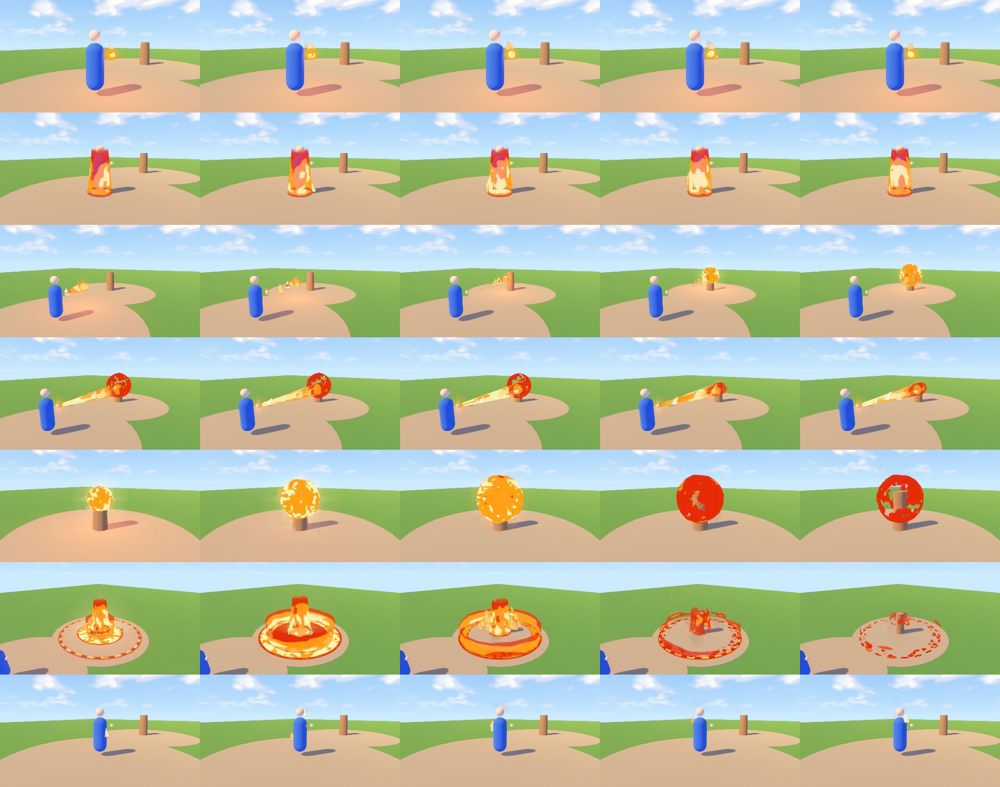
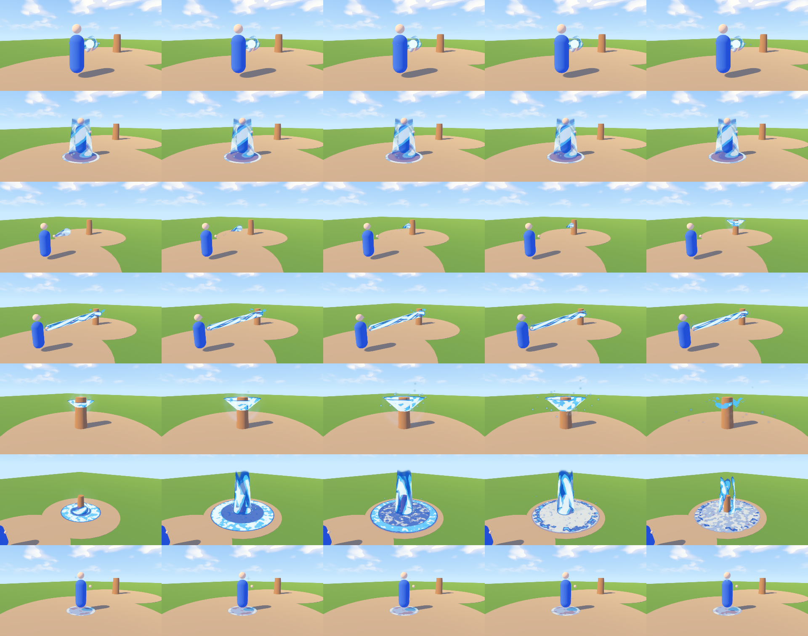
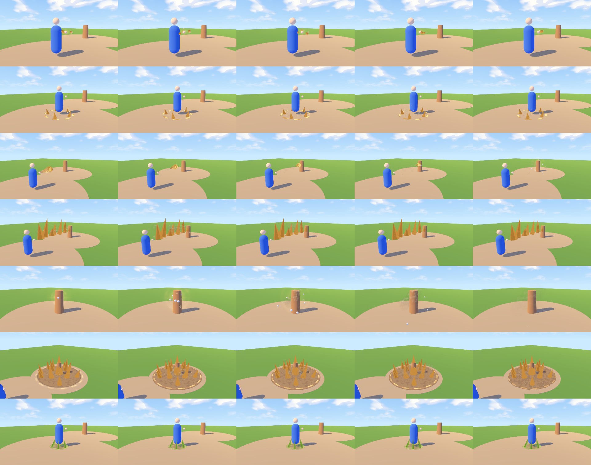
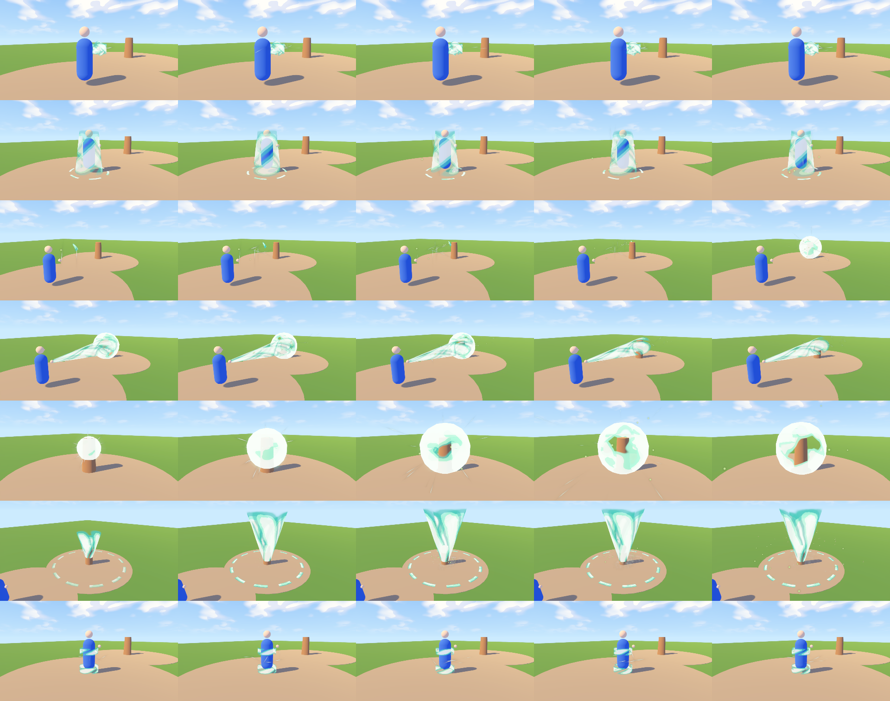
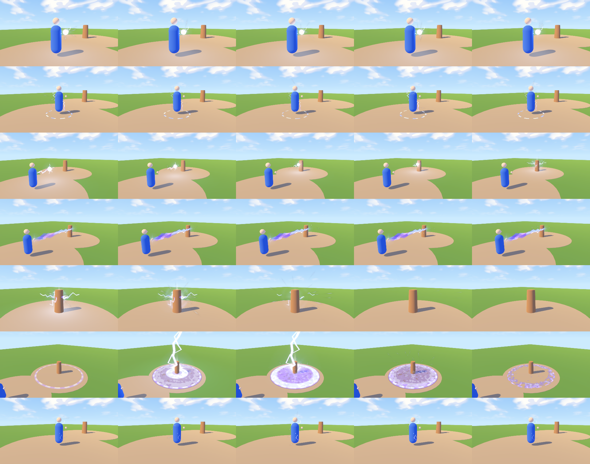
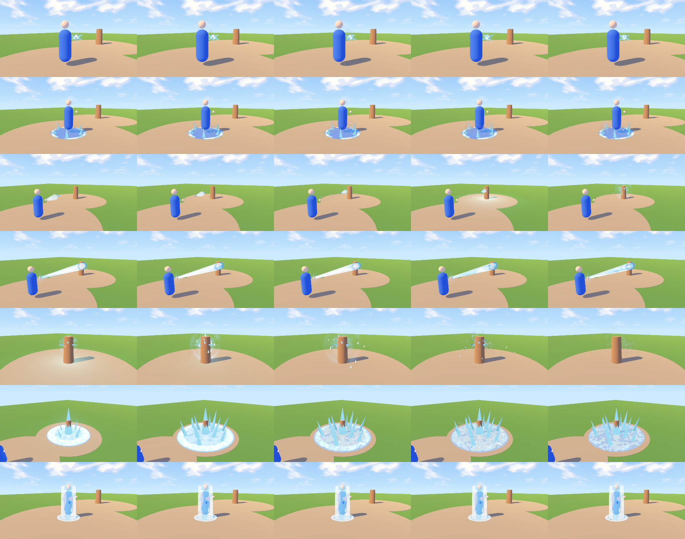
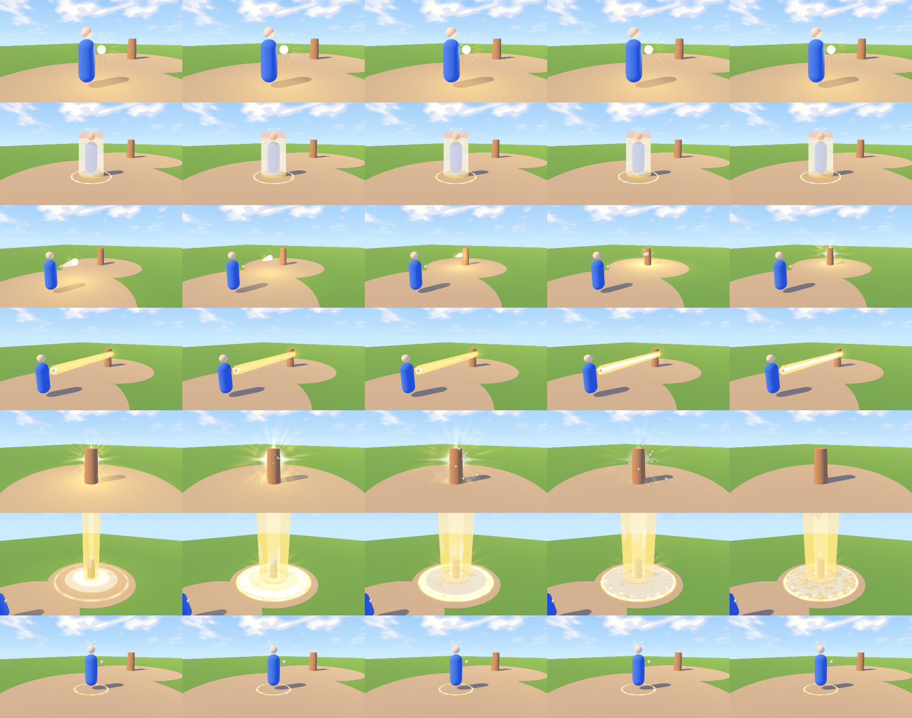
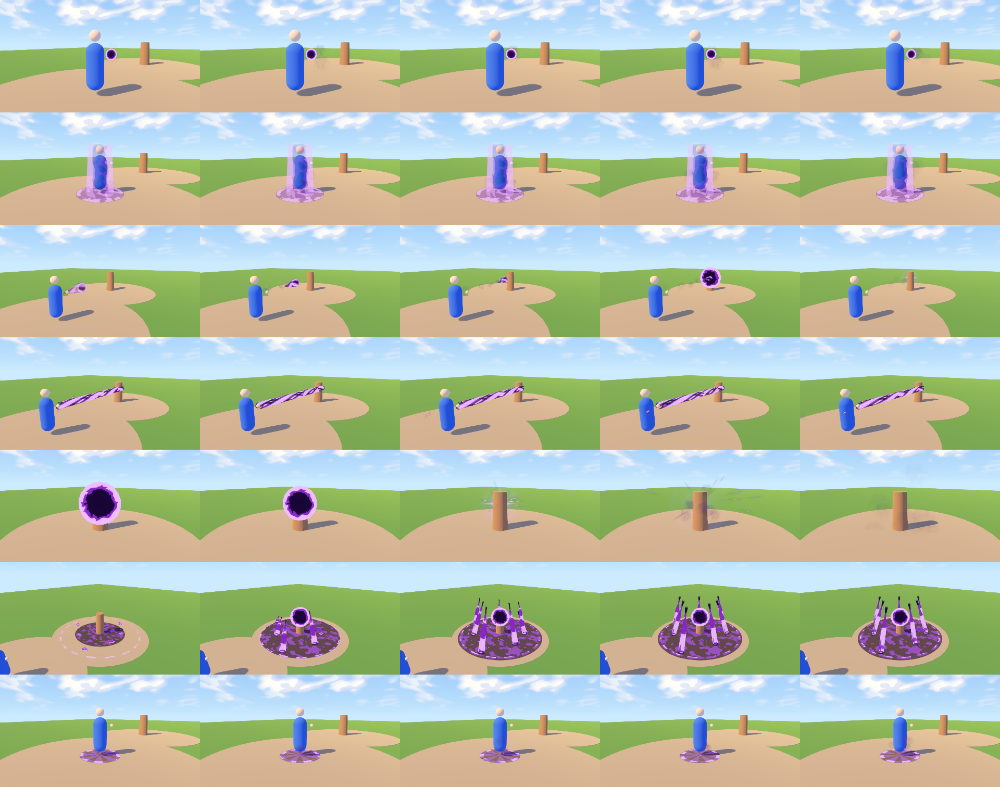
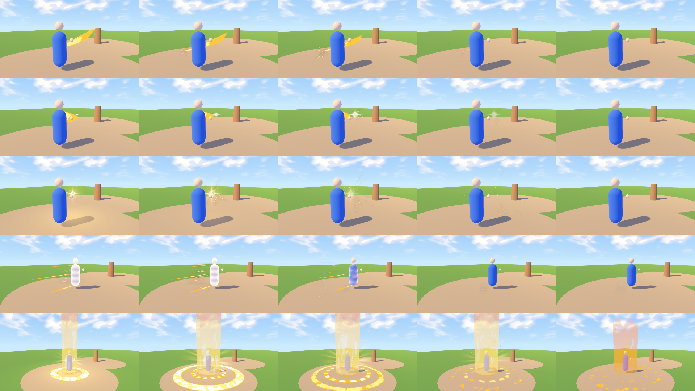

# Elemental VFX set

Eight elements (fire, water, earth, wind, lightning, ice, light, dark) x seven effect types, plus generic melee, dash and level-up effects.
All scenes are real `.tscn` files under `kingdom/scenes/vfx/elements/<element>/<type>.tscn` (61 scenes), spawned and pooled through one helper: `kingdom/scripts/vfx/element_fx.gd` (`ElementFX`).
Shaders: `kingdom/shaders/vfx_elements/` (original code; particle textures are the CC0 Kenney / RPicster set in `assets/incoming/vfx_free/`).

Gallery: `kingdom/tools_qa/vfx_gallery/elements_gallery.tscn` (F6). Left/Right = element, Up/Down = type, Space = replay, A = auto-cycle, G = generic effects, H = hide UI.
The scenes are generated by `tools_qa/vfx_gallery/build_element_scenes.gd` (edit the recipe, then run `Godot --headless --path kingdom --script res://tools_qa/vfx_gallery/build_element_scenes.gd`; add `-- fire,ice` to rebuild only some).

## Look
Warm hand-painted storybook: cel-banded colour (core / mid / edge per element, `ElementFX.PAL`), alpha-blended bodies so effects stay saturated on a bright sunny ground (pure additive washes out to white in daylight), additive only for small glows, sparks and lightning. No neon, no black outlines. Darks use a dark body with a bright violet rim so they read on light ground.

## Catalogue
Each contact sheet: one row per type (charge, aura, projectile, beam, impact, aoe, status), five moments in time left to right (first / last frames show the fade). Stage: caster on the left, target post 6 m away, sunny storybook sky.

| Element | Sheet | Charge (hand) | Aura (body) | Projectile + trail | Beam | Impact | Ground AOE | Status loop |
|---|---|---|---|---|---|---|---|---|
| fire |  | flame orb + embers | flame sheath | fireball + comet flame | flamethrower cone | fireball burst, smoke | nova ring + flame wall + pillar | burning |
| water |  | swirl orb + orbiting drops | spiral water sheath + bubbles | water orb + spiral tail | water jet | splash crown + droplets | wave ring + geyser + puddle | wet (drips) |
| earth |  | orbiting stones | floating stones + rune ring | spinning rock + dust | line of erupting spikes | rock burst + chunks | spike field erupting | rooted (vine roots) |
| wind |  | counter-rotating air bands | spiral gust sheath | crescent wind blade | gust cone | gust sphere + leaves | tornado | windswept ankles |
| lightning |  | crackling orb + arcs | body arcs | bolt orb + arc tail | jagged arc beam | star flash + radial bolts | sky strike + telegraph ring | shocked arcs |
| ice |  | crystal ring | frost mist + crystals | ice lance | frost ray | shard burst | frost nova + ice spikes | frozen coat + crystals |
| light |  | radiant orb + rays | halo + golden sheath | radiant orb + comet | holy ray | star burst | light pillar + sigil (heal burst) | blessed halo |
| dark |  | void orb + wisps | smoke veil + shadow | void orb + swirl tail | drain beam | implosion + burst | void disc + orb + tendrils | cursed sigil + wisps |
| generic |  | sword slash, fist slash, hit sparks, dash trail (+ ghost afterimages), level-up / awakening burst | | | | | | |

Best single frames: `fire_aoe_2.png`, `dark_aoe_2.png`, `ice_aoe_2.png`, `lightning_aoe_1.png` (full resolution, 1280x720). Motion review sheets (Movie Maker, 30 fps): `frames/`.

## API (`ElementFX`, static)
```gdscript
ElementFX.play(&"fire", &"impact", pos, dir, scale)          # one-shot at a world position (dir = -Z forward)
ElementFX.attach(&"water", &"charge", hand_node, 1.0)         # loop, follows a node (hand bone, character root)
ElementFX.stop(fx)                                            # fade a looping effect out, then it returns to the pool
ElementFX.projectile(&"fire", from, to, 18.0, 1.0, on_hit)   # flies, stops its trail, plays impact on arrival
ElementFX.beam(&"lightning", from, to, 1.0, 1.5)              # channelled; ElementFX.aim_beam(fx, from, to) to re-aim
ElementFX.aoe(&"earth", ground_pos, radius_m)                 # 3 m radius at scale 1
ElementFX.chain(&"lightning", [p0, p1, p2])                   # arcs hopping along the points
ElementFX.slash(&"ice", pos, yaw, tilt, radius, fist)         # sword / fist arc tinted with the element
ElementFX.hit_sparks(el, pos, dir)  ElementFX.dash(el, character)  ElementFX.level_up(pos, el)
```
Element ids accepted (see `ElementFX.canon`): fire water earth wind lightning ice light dark; aliases frost, holy, heal, qi, shadow, void, air, storm, thunder, wood, stone. The game's current skill trees use fire/water/wind/earth/lightning/qi/shadow: qi maps to light, shadow to dark.
Types: `TYPES = charge aura projectile beam impact aoe status`, `GENERIC = slash_sword slash_fist hit_sparks dash level_up`.
Everything is pooled (`ElementFX._pool`, up to 6 idle instances per scene), materials are duplicated once per pooled instance, no per-frame GDScript except one `_process` per *active* effect (a few shader parameters). Gameplay wiring (inputs, damage, cooldowns) is intentionally not part of this.

### Quality tiers and renderers
Read from the `Quality` autoload (not modified): LOW hides nodes flagged `tier_min >= 1` (smoke, embers, second glints, scorch/mist layers), halves particle `amount_ratio`, no lights. MEDIUM 75 % particles, no lights. HIGH/ULTRA: everything, plus a short OmniLight flash on impacts/aoes and steady lights on charge/projectile. On `gl_compatibility` every GPUParticles3D is converted to CPUParticles3D at first use (amount capped at 24, `element_effect.gd`).

## Pairing with the animation clips
Effects are built as charge -> release -> travel -> impact. Names below use the pattern of the new animation library (`Cast_Fire_Projectile_1H`, `Cast_Earth_Slam`, ...); adapt to the exact clip names.

| Clip phase | Effect call |
|---|---|
| Cast wind-up (hand up, first 30-60 % of any `Cast_*`) | `attach(el, &"charge", hand_bone)`; add `attach(el, &"aura", character)` for big/ultimate casts |
| Release frame of `Cast_<El>_Projectile_*` | `stop(charge)`, then `projectile(el, hand_pos, target)` (impact plays itself) |
| `Cast_<El>_Beam` / channel loops | `beam(el, hand_pos, target, width, seconds)` + charge held; `stop()` on clip end |
| `Cast_Earth_Slam`, `Cast_*_Slam`, `Cast_*_Overhead`, ground-hit frame | `aoe(el, ground_pos, radius)` on the contact frame (earth spikes, fire nova, ice nova, water geyser) |
| `Cast_Wind_*` sweeps | `aoe(&"wind", pos, r)` (tornado) or `projectile(&"wind", ...)` (crescent blade) |
| `Cast_Lightning_*` raise-arm | `aoe(&"lightning", pos)`: 0.28 s ring telegraph then the sky strike; `chain()` after a hit |
| Sword swings / martial combos (`Attack_*`, `Kick_*`, `Punch_*`) | `slash(el, chest_pos, yaw, tilt, radius, fist)` on the swing's middle frame, `hit_sparks` on contact |
| Dash / dodge clips | `dash(el, character)` at the first frame (ribbons + the game's ghost afterimages) |
| Buff / debuff states | `attach(el, &"status", character)` while active (burning, wet, rooted, frozen, shocked, blessed, cursed, windswept), `stop()` at expiry |
| Awakening, level up, blessing gained | `level_up(character_pos, element)` |

Timings (seconds from `play`): projectile impacts last 1.0, slashes 0.4-0.6, hit sparks 0.5, aoe 1.6-2.5 (lightning strike lands at 0.28, ice spikes shatter at 1.4-2.0, earth spikes sink at 1.4-1.8).

## Cost (RTX 4070 laptop, Mobile renderer, 1280x720, `--perf`)
Per-effect table: `perf.tsv` (regenerate: `Godot --path kingdom --rendering-method mobile --resolution 1280x720 res://tools_qa/vfx_gallery/elements_gallery.tscn -- --perf=<dir>`).
GPU time is the delta against the empty stage; single-frame peaks are dominated by GPU clock jitter and other processes (several show negative averages), so trust the averages.

| Effect | avg GPU delta | particles (peak) | mesh nodes | draw calls (peak delta) |
|---|---|---|---|---|
| worst average: fire impact | +0.26 ms | 26 | 3 | 7 |
| big AOEs: fire / water / earth / ice / light / dark / wind / lightning | +0.12 / +0.16 / -0.02 / +0.09 / +0.14 / +0.03 / +0.08 / -0.20 ms | 60 / 44 / 40 / 36 / 40 / 40 / 48 / 34 | 5 / 4 / 17 / 19 / 6 / 10 / 3 / 7 | 8 / 6 / 20 / 22 / 7 / 12 / 6 / 9 |
| loops (charge / aura / status) | -0.15 to +0.14 ms | 4-22 | 0-8 | 3-10 |

All effects stay below the 1 ms target on the desktop GPU (average delta <= 0.3 ms). Mobile expectations: fill rate dominates (large alpha-blended shells and ground discs: fire aoe, earth/ice aoe with 17-19 opaque spikes, light pillar). On a mid-range Android GPU (roughly 10-20x slower than this laptop GPU for fill) a single big AOE at 1080p may cost 2-4 ms; keep one big AOE alive at a time on LOW, and prefer the LOW tier's halved particles and dropped secondary layers. Draw calls: 3-20 per effect. Particle counts are 4-60 per effect, all with 30 fps fixed timestep.

## Adding an element or effect
Edit `build_element_scenes.gd` (`build_<element>()` functions use small helpers: `mesh`, `spr`, `ps`, `spike`, `bolt`, `fxmat`), rebuild, look at the gallery. Shape shader parameters are documented at the top of `shaders/vfx_elements/el_body.gdshaderinc` (`shape_mode` column / ground ring / orb / ribbon, `progress` dissolve, `heat_scale`, `cel`, spiral, flicker...). Beware: `BILLBOARD_PARTICLES` ignores scale in Godot 4.6.3, so particles use `transform_align` and big glows use the `el_sprite` shader.
