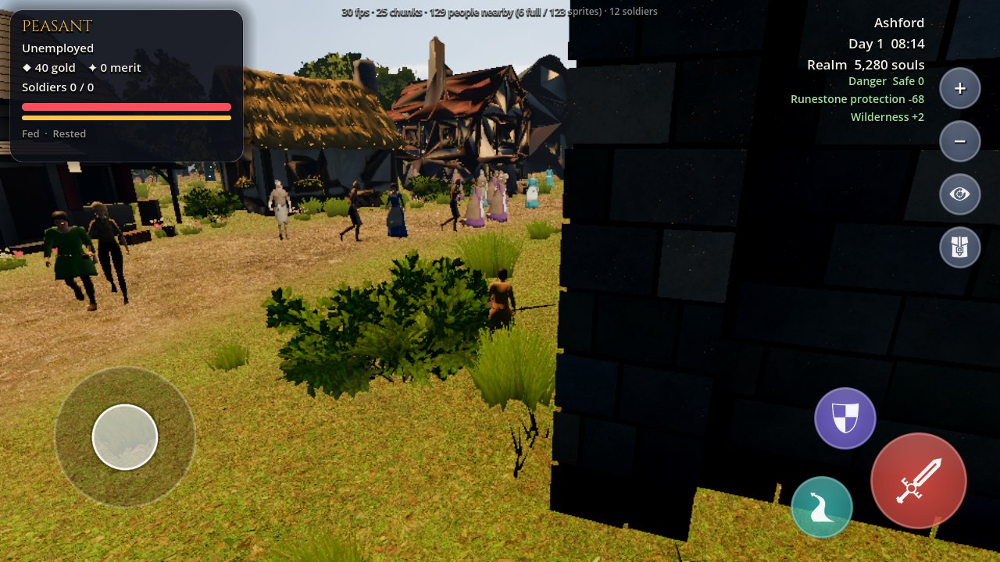
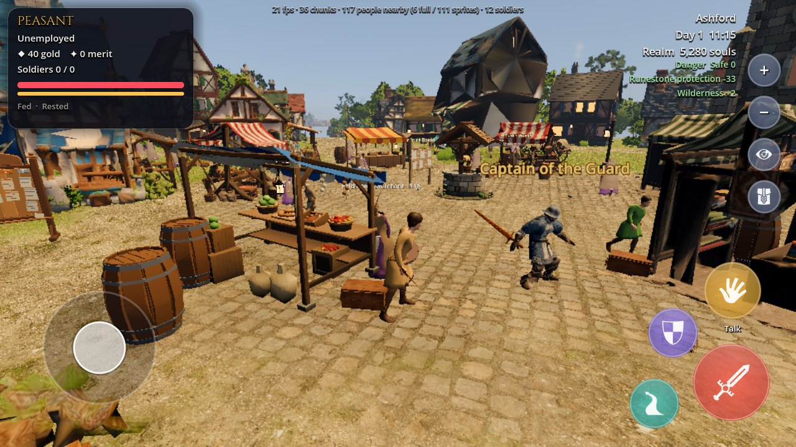
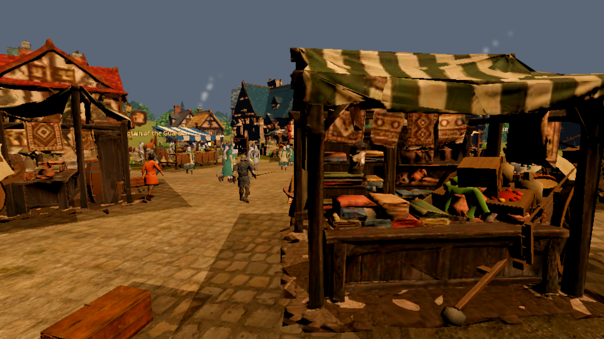
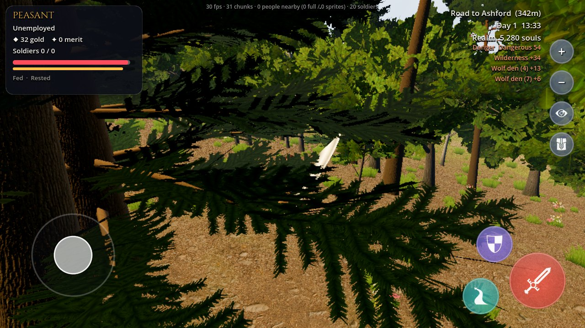

# Current playtest visual and movement review

**Purpose:** give Claude a small, source-grounded review target from the latest local playtest artifacts without editing game code.
**Inspected baseline:** `claude/focused-curie-m09hbd` at `e3563fc4`; its animation report, autoplay output, and screenshots were still in progress and uncommitted when reviewed on 2026-09-27.
**Scope:** visible camera obstruction, what the current screenshots prove about NPCs, and the evidence needed to verify collision and route behavior.

## 1. The first-walk camera is still heavily obstructed

In the first playable movement capture, a nearby dark building surface fills roughly the right half of the screen. This is a visible obstruction in the saved frame, regardless of whether the camera ray detects the building collider in other shots. It contradicts treating camera occlusion as fully closed. The screenshot does not establish whether the cause is collision shape coverage, camera-arm length/offset, collision mask, or a timing issue; inspect the camera ray and collider at this exact player position before changing the camera.

**Review check:** reproduce the saved position and camera yaw, then walk and rotate around the building corner. Capture the camera origin, desired camera point, ray hit point/normal, collider owner, and final camera point in a QA overlay. Confirm the camera stays outside solid surfaces during both slow movement and turns, and that it returns smoothly when the obstruction clears.

## 2. The market sightline needs a moving camera check

The market frame shows several full 3D residents around stalls, but it is a single instant. The fixed low-mobile benchmark camera places a large foreground stall across most of the right side and top of the view, narrowing the visible route through the plaza. The benchmark deliberately teleports the player to a fixed coordinate and sets one camera angle; this flags a framing/readability risk, but does not prove that the live camera is colliding with the stall or that NPCs pass through it.

Use the marked plaza lane as a camera and crowd QA route: walk past the foreground stall on both sides, turn toward the service counter, and watch a resident approach and leave it. Capture the live camera boom and obstacle hit, player capsule, stall collision shapes, NPC path/target, and two normal-play frames before/after the turn. The stall should remain legible as a service point while the pedestrian lane and approaching characters stay visible; keep counters and support posts solid where the art shows them.

The market playtest image is still useful as a location and crowd-composition reference, but it cannot establish that residents avoid stalls, two bodies collide, the player cannot pass through them, or a character has a natural start/stop/turn cycle.

The separate low-mobile benchmark also shows the visual density and camera proximity around a large foreground stall. It is useful for checking framing and readability; without a moving capture or collision overlay it cannot distinguish a deliberate close camera from a collision defect.

## 3. Forest foliage hides the wolf contact

The saved wolf-player-hurt frame is dominated by conifer branches; the attacking wolf and player contact point cannot be read clearly. This is direct evidence of a combat sightline problem. It is not usable visual proof of whether the wolf mesh, root, or collision body penetrates the player.

Repeat the bite at the same location with a normal-play capture and a debug capture. The normal camera should keep the combatants readable as the player circles or backs away; if a nearby branch crosses the view, fade that foliage smoothly. The debug capture should show the wolf's body shape, root position, attack reach, player capsule, and contact frame. Evaluate foliage readability and physical contact as separate outcomes.

## 4. Current playtest coverage does not prove the NPC movement requirements

The autoplay route drives the player with virtual joystick inputs and visits buildings and NPC interaction targets. Its saved screenshots and log are strong evidence for player reachability and menu flows, but they do not record a villager being assigned a destination behind a building, following a path, meeting another resident, colliding with the player, or crossing an LOD boundary while travelling. Those are the cases behind the reported “NPCs walk through Meshy buildings and players” problem, so that issue remains unverified by this playtest even when every player `walk_to` succeeds.

The helper reports `walk_to` as “arrived” once the player enters that call's requested tolerance. The tolerance is deliberately different for different targets (for example, 2 m for a general plaza target and 0.5–1.6 m for several interaction approaches). Include the tolerance in the log or report the result as `within requested radius`; do not compare the final distance to zero or interpret every 1–2 m remainder as a movement bug.

The run also records one freed-lambda error while the cutscene is being skipped. It is in the autoplay wait predicate around `autoplay.gd`'s `_step_boot()` and `wait_until()` call. Treat this as a test-harness reliability issue to reproduce and fix separately; it does not establish a game runtime error.

## Minimal next capture for collision and natural motion

Use one repeatable market-to-door route and save both a normal view and a debug view. Run each case at least three times from the same saved time and actor seed.

| Case | What to exercise | Evidence that settles it |
|---|---|---|
| NPC route behind a Meshy building | Assign a visible resident a reachable anchor on the far side of a collidable building | Foot path overlaid on navmesh; actor never enters the building footprint; destination/arrival state logged |
| Player and resident contact | Walk directly into a resident from the front and side, then release input | Both capsule positions and velocities; minimum separation; response/recovery capture |
| Two residents in a narrow lane | Start two residents on opposing routes | Both routes, avoidance velocities, wait/yield state, and whether they resume without shaking or deadlock |
| Stall approach | Send multiple residents to the same service | Distinct reserved approach spots or a visible queue; no body through counter or stall |
| LOD handoff during travel | Promote and demote a resident partway through the same route | Position and goal before/after handoff; no snap, wall crossing, or duplicate movement authority |
| Camera around the first-walk building | Reproduce the saved viewpoint and move past its corner | Ray hit/collider and camera positions; no surface filling the view; smooth recovery |

For close actors, the debug view should make the following visible at once: actor ID, current state, goal/anchor ID, nav path, desired and resolved velocity, body capsule, avoidance radius, animation clip and playback scale, and LOD tier. This can be a QA-only overlay or a captured inspector sheet; it need not appear in the shipped HUD. Keep a paired normal-view clip so the debug overlay does not substitute for judging whether the motion feels human.

## Relationship to ongoing work

- Claude's local `docs/qa/anim_qa_report.md` is already the active clip and locomotion-speed review. This note does not repeat its speed table or ask for competing animation edits.
- The autoplay report's ignored-library/import request predates the inspected branch packaging: the four extra-library import descriptors are now tracked, `.gdignore` is absent for that library, and the loader checks resource existence. Refresh report requests against source; a clean Godot import and actual required-clip playback remain unverified by this source check.
- [NPC life-loop design](NPC_LIFE_LOOP_DESIGN.md) describes schedule, anchor, near-body, route, and LOD behavior contracts.
- [Collision visual audit](COLLISION_VISUAL_AUDIT.html) and [NPC route audit](NPC_ROUTE_AUDIT.html) cover static fitted-collider geometry and straight-line route intersections. The cases above add the missing moving-runtime evidence.
- [Natural world feel plan](NATURAL_WORLD_FEEL_PLAN.md) remains the broad implementation sequence. Re-run this focused capture after the camera and near-actor movement pass.

## Source and evidence locations

The screenshots were copied from the local Claude checkout at review time into `qa_evidence/` so this review remains viewable from the docs branch. The corresponding original run artifacts were under `docs/qa/playtest/` and `docs/qa/bench_village_low_mobile.png`. The autoplay driver is `kingdom/tools_qa/autoplay/autoplay.gd`; its `walk_to()` tolerance and cutscene wait predicate are implementation details to confirm against the next run, not permanent API contracts.
