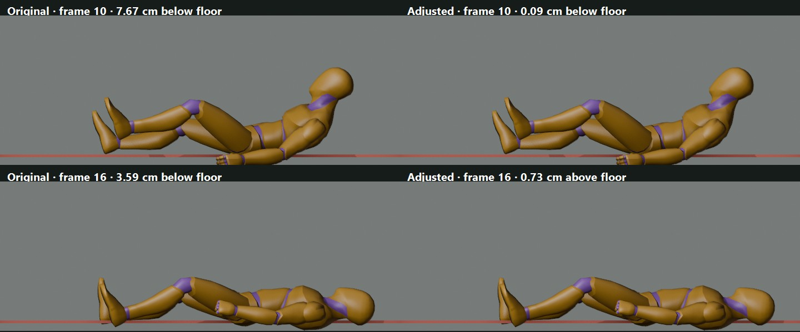

# Hit Knockback Floor Contact — Retarget Review

A Blender prototype added a smoothed vertical root curve to Quaternius UAL2 `Hit_Knockback`. It looked promising on the reference mannequin, so the candidate was injected into the game's existing animation QA runner without changing game source. The full results are in the [interactive 27-profile review board](HIT_KNOCKBACK_RETARGET_REVIEW.html).

On the Blender source mannequin, the worst sampled floor penetration dropped from 9.65 cm to 0.09 cm. In a scratch copy of Godot's game-loader QA, all 27 humanoid profiles improved, but the worst penetration only dropped from 34.3 cm to 27.8 cm; 14 profiles still penetrate at least 5 cm. The maximum planted-foot slip also increased from 64.4 to 84.8 cm/s. The prototype is therefore **not suitable as a shared gameplay replacement** without more retarget-aware work.

The Godot harness completed and wrote the 27 rows, then hit the known native shutdown crash with resources still in use. The candidate GLB and metadata remain in the incoming animations folder as a clearly documented, non-integrated experiment. Claude should keep existing game wiring until a revised solution passes all 27 profiles and live player guard-break / soldier heavy-hit review. No game scripts, scenes, settings, or aliases were changed.
