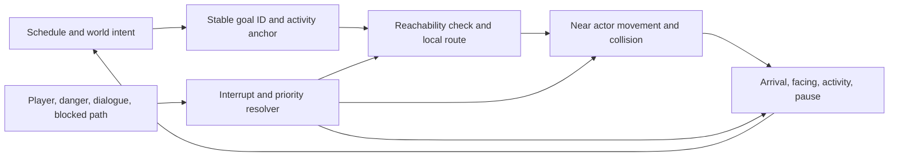

# NPC life-loop design for Rising Ashes

**Status:** implementation design for Claude; not a runtime implementation.

**Baseline inspected:** `claude/focused-curie-m09hbd` at `e3563fc4` (the game branch may have moved; refresh before changing code).
**Purpose:** turn the existing schedule and population system into visible, physical, interruptible lives without making the whole population expensive.

## Current implementation snapshot (2026-09-30)

The older source notes below describe the pre-integration baseline at `e3563fc4`. They are useful as historical diagnosis and design rationale, but several findings have since been implemented. The current Codex branch is `gpt/locomotion-jump-integration`, based on the fetched Claude branch `b6cc215c`. Recheck current source before making changes; this status section supersedes conflicting older statements below.

| Area | Current source state | Remaining boundary |
|---|---|---|
| Population and schedule | `WorldSim` keeps deterministic resident data in packed arrays, runs a time-budgeted slice, prioritizes people around the player, and changes home/work/market targets. It also pays job wages and market spending. | The far population still moves directly toward a target in a straight line; it has no route cursor or persistent daily activity history. |
| Near-resident movement | `Villager` is a `CharacterBody3D` with acceleration, braking, a `StreetGraph` route through settlement streets/door paths, stuck detection, separation/yield steering, and explicit position ownership: `WorldSim` stops integrating a promoted body's data row until its resolved position is transferred back. | This is not a general navmesh/NavigationAgent system. Field/forest goals, invalid destinations, proxy accuracy, and live LOD transitions still need evidence on a representative route. |
| Physical contact | A full-model villager has a capsule that is enabled near the player, with enter/exit hysteresis. `PopulationLOD` caps the nearest actors allowed to use contact physics. | Skeleton/model, sprite, and contact budgets are separate; soft NPC separation is not proof that all actors visibly occupying a close crowd are physically blocked. Verify which visible overflow cases remain. |
| Presentation and cost | Current `PopulationLOD` uses a 45 m full-model range, 220 m sprite range, up to 24 normal full-model slots subject to `Quality`, a 9 m near override capped at 12, and a combined sprite ceiling of 140 subject to `Quality`. It promotes at most three new models per refresh. Villager animation/shadows and contact physics are distance/budget limited. | Treat these as current source settings, not a guarantee of frame rate on a particular phone. Use same-device captures and the latest performance report before changing budgets. |
| Near behavior | `UtilityBrain` scores 13 simple acts with five needs, seeded traits, schedule, weather, danger, and spectacle inputs. Decisions are staggered; threat samples and sight rays are shared/capped. Villagers can work, seek food/rest/water/faith/social activity, shelter, flee, or watch. | Need values live only in the embodied brain and are re-seeded on body creation/resync; there is no durable citizen relationship graph or episodic memory in `WorldSim`. See [NPC need continuity handoff](NPC_NEEDS_CONTINUITY_HANDOFF.md). |
| Player and combat feel | The Codex branch includes the authored jump flow, run-stop integration, reaction timing, local hit pause, block-facing, wolf turning, camera occlusion easing, and dodge lane probes. | These changes still need playable-game confirmation; see [locomotion/jump handoff](../anim/CODEX_LOCOMOTION_JUMP.md) and [systems handoff](CODEX_SYSTEMS_HANDOFF.md). |

Do not restart the NPC system or add a second crowd/AI framework. Continue by closing one observed seam at a time: reproduce it in the latest game, preserve one owner for each piece of state, change the smallest responsible layer, then capture both behavior and mobile cost.

## Historical pre-integration source observations (e3563fc4; superseded in parts)

The [interactive daily-rhythm viewer](WORLD_DAILY_RHYTHM_REVIEW.html) exposes an additional source-level behavior risk: residents with the same job change phase on exact shared clock boundaries, and the simulation applies their new targets in a short update burst. The schedule table, real-time conversion, and a deterministic staggering design are in [WORLD_DAILY_RHYTHM_DESIGN.md](WORLD_DAILY_RHYTHM_DESIGN.md).

The current system has a strong foundation: all residents exist cheaply as data in `WorldSim`; `PopulationLOD` promotes only a limited near set to full models; and work/home/market intent is already derived from the time of day. The gap is between that intent and what the player sees.

- `WorldSim._current_phase()` selects only home, work, or market. `_on_phase_change()` replaces a person's target with a newly selected point. `_simulate_slice()` advances the position directly toward it at `WALK_SPEED`, in a straight line.
- `WorldSim._spot()` can choose a point by distance and angle, and shop/home targets stand near a lot. A target is not an authored entrance, counter, field row, patrol node, or occupied activity anchor.
- `is_indoors()` hides some people when their simulation position is within one metre of a target. There is no visible arrival sequence or proof that the target is a traversable door.
- `PopulationLOD` gives near residents a model and far residents a billboard. `Villager` is a `Node3D`, has no body collision, and chases `WorldSim.pos` directly in `_process()`. At a gap over four metres it temporarily follows at up to 4.8 m/s, despite the normal 1.6 m/s visual speed. It switches directly between `Walking_A` and `Idle`.
- The [follower/gait review](NPC_FOLLOWER_ANIMATION_REVIEW.html) and [source notes](NPC_FOLLOWER_ANIMATION_REVIEW.md) trace a new frame-rate/population interaction: `WorldSim` updates at most 1,500 rows per frame, while the embodied villager only selects `Walking_A` when its gap to the data position exceeds 0.15 m. This is a measured source-level hypothesis about why visible NPCs may glide or flicker between states; capture the actual gap, resolved velocity, clip, and playback rate before treating it as a proven runtime failure.
- `Critter` selects a random point within a radius and moves directly there while sampling terrain height. Its own comment explicitly says it has no physics or navigation. `Wolf` and `Monster` also advance their global position directly toward the target. The hostile state machines add intent, but the movement does not route around buildings or resolve body contact.

These are source observations. They do not by themselves prove that every visible failure still reproduces on the latest working game branch. Re-run the named checks after Claude's current QA pass.

## The behavior model to build

Keep schedule truth cheap and persistent. Make the close, visible actor a presentation and physical-execution tier for that truth.

### Authority and data

Keep `WorldSim` as owner of schedule, job, home, money, long-term goal, and low-detail position. Add stable goal identity and a compact coarse movement state only if needed for representation handoff. Avoid turning all 20,000 residents into physics nodes.

When a resident is promoted to the near tier, initialize the body at the stored world position and let its physics controller own motion while embodied. It reports its resolved position and arrival/goal status back at a controlled cadence. Do not have both the simulation and the body advance the same resident at once. On demotion, store the body’s final position and meaningful state before freeing it. Promotion/demotion must never snap an actor through a wall or back to an old simulation point.

The [contact and LOD contract](NPC_CONTACT_LOD_CONTRACT.md) makes this handoff concrete and addresses a cap exception: model selection and three-spawns-per-refresh do not guarantee that every close visible resident has a full model. Separate contact eligibility from skeleton budgets, define an overflow/density policy, and preserve one movement owner through proxy/full-model swaps.

### State set and interrupt order

Use a small state set with explicit entry/exit behavior. It can be an enum plus data, an existing behavior-tree tool, or another fitting structure; preserve the existing project architecture unless evidence justifies a dependency.

| Priority | State | Entry | Visible behavior | Exit |
|---:|---|---|---|---|
| 0 | `dead_or_unavailable` | death, despawn, invalid actor | existing death/despawn handling | explicit respawn or lifecycle event |
| 1 | `combat_or_flee` | confirmed threat or damage | face threat, approach/retreat on a valid route, play attack/hit/recovery/flee animation | threat resolved, lost, or actor disabled |
| 2 | `dialogue_or_interaction` | player starts a supported interaction | stop at interaction range, turn toward player/anchor, use the interaction pose | interaction ends or higher priority danger occurs |
| 3 | `yield_or_react` | imminent player/crowd contact, startling event, blocked goal | brake, glance/turn, sidestep to a reachable point or wait, then resume | clear path plus brief recovery, or priority change |
| 4 | `travel` | schedule or local activity chooses a new goal | follow path with accel/braking and turn animation; do not walk through buildings | within anchor arrival radius, path fails, or interruption |
| 5 | `arrive` | actor reaches anchor approach point | decelerate, face anchor, settle into activity pose | anchor acquired, unavailable, or interruption |
| 6 | `work / socialize / wait / rest` | activity anchor granted | loop a suitable action with subtle idle variation; respect occupancy and plausible duration | schedule change, interruption, or activity timer |
| 7 | `leave` | activity ends or schedule goal changes | exit using its approach point, then travel to new goal | next anchor/goal reached or interrupted |

Priorities are evaluated in that order, but persistent activities should not restart every frame. State changes should be event-driven or checked at a bounded rate. Add hysteresis to threat, distance, and path-failure thresholds so an actor does not chatter between states.

Use an explicit switch-out/switch-in contract when a higher-priority state interrupts a resident. Finish or safely cancel the current action, release its route, anchor, held-item, speech, or attack reservation, then initialize the new owner and its entry pose. Preserve the old goal as intent and revalidate it before resuming. Do not let two states drive the same body transform. The research-grounded details and three annotated interruption examples are in [behavior and animation transition design](NPC_ANIMATION_TRANSITION_DESIGN.md) and its [interactive handoff viewer](NPC_TRANSITION_HANDOFF_REVIEW.html).

## Goals and activity anchors

A position alone does not describe a believable destination. Represent a goal as a stable identity and a small anchor record:

- owning settlement/building/activity ID;
- approach position on a reachable path surface;
- facing direction or look target;
- interaction/activity type;
- acceptable arrival radius;
- occupancy capacity and current reservation;
- optional use duration and animation/action set;
- fallback anchors when occupied or unreachable.

Examples: an inn entrance approach, a blacksmith's work side of the counter, a market stall customer spot, a field work point, a guard's patrol node, a bench seat, a stable feeding point. Keep a door anchor outside the threshold and an interior point distinct; an actor should only be considered indoors after actually reaching a valid portal/arrival point.

On assignment, first validate that the approach point is reachable. If the primary anchor is occupied, choose another compatible anchor, wait in a queue position, or select a nearby meaningful activity. Never make every person target the same exact counter point. Release the reservation on interruption, timeout, actor removal, or schedule change.

## Motion and physical contact

For the near embodied tier:

1. Use a physics body/capsule for contact with approved solid world collision and other near actors.
2. Use navigation for the global path around static obstacles; use local avoidance or steering for moving agents and personal space; use physics for final body contact. These solve different parts of the problem.
3. Advance the body in the physics step. Rotate toward actual travel or interaction facing with bounded angular acceleration. Approach destinations with braking distance, not a constant-speed overshoot.
4. Detect stuck motion by comparing desired progress with actual progress over a short window. Escalate: slow/wait, try a reachable side-step, repath, then choose a safe fallback activity. Do not teleport through a blocker to hide failure.
5. Use different response profiles: a child, a laden worker, a guard at post, a horse, and a chicken should not share the same radius, turn rate, or yielding rule.

For distant data and sprite tiers, retain cheap simulation and schedule updates. Their approximated paths still must not jump through visible solid buildings when entering or leaving the represented region. Use a connected coarse route graph or a validated abstract travel transition; only promote an actor close enough for its collision and detailed animation to matter.

## Animation and sensory response

Animation follows resolved motion and state, not the requested target vector. Blend walk/run from measured horizontal speed after calibration against the QA clip speeds. Add start, brake, turn/pivot, wait, work, look, hit, and recovery transitions only where the rig has a suitable clip. Crossfade state changes and preserve current gait phase where appropriate; do not restart a loop each physics tick.

For noncombat reactions, use small readable signals: orient eyes/head or torso toward the player, pause a task briefly, make space, then return attention to the original activity. Keep this local and event-triggered. Don't run expensive gaze/avoidance logic on distant impostors. Use small deterministic variation in wait duration, gait phase, facing, and idle action so nearby actors do not repeat one identical loop in sync.

Footsteps and surface effects should be tied to actual locomotion and ground material after speed calibration. Work audio, doors, and tool sounds should fire from activity events. Audio timing must not mask a broken foot plant or an actor sliding across a stationary idle.

## Implementation sequence

1. **Observe:** record the same village market loop with a doorway, crowded route, work anchor, and player interruption. Capture normal view plus collision/path/state overlays. Use the existing current QA route if Claude's active work supplies one; don't duplicate it.
2. **Anchor proof:** add one meaningful set of entrance and stall approach anchors. Verify reachability, occupancy, reservation release, and “indoors after arrival” on these points.
3. **Near-body proof:** embody a small capped set of villagers and prove world collision, player contact, yielding, and exact LOD handoff. Measure body and avoidance counts on LOW/HIGH.
4. **Route proof:** route villagers around a building and blocked stall; test destination on the far side and a streamed boundary. Ensure there is no line-of-sight shortcut through walls.
5. **Life-loop proof:** complete one work-to-market-to-home cycle with arrival, action, interruption, and recovery. Add actors/anchors one job type at a time.
6. **Animation pass:** use Claude's game-loader QA and same camera captures to calibrate locomotion and inspect state transitions across each rig family.
7. **World extension:** reuse the actor contract for wolves, monsters, and near wildlife with role-specific pursuit/flee/social distance. Keep distant wildlife cheap.
8. **Scale and regression:** compare the same route on LOW/HIGH and a mobile target; record frame-time percentiles, active bodies/agents, route failures, crowd stalls, and a short visual capture.

## Acceptance matrix

| Scenario | Pass condition | Evidence to save |
|---|---|---|
| Resident changes home/work/market goal | One transition, valid goal identity, no repeated target reset | state/goal trace and capture |
| Goal behind Meshy wall | Route uses street and real entrance or selects a documented fallback; actor never cuts through the wall | path overlay, collision overlay, video |
| Two people meet in narrow lane | At least one yields or waits; both resume without shaking, capsule tunneling, or permanent deadlock | repeated approaches from both directions |
| Player walks into a villager | world/player/near-NPC bodies stop penetration; villager has a readable brief response and recovers | collision debug and repeated contact capture |
| Stall is crowded | actors reserve distinct spots or queue and leave cleanly when service ends | occupancy trace and market capture |
| Player starts dialogue during travel | path motion brakes; actor turns; it resumes or returns to its prior goal afterward | state trace and capture |
| Threat interrupts work | worker leaves activity through valid path; task/anchor reservation is released or safely restored | event trace and combat capture |
| LOD promote/demote during travel | no positional snap, wall crossing, stuck body, or lost schedule state | fixed route with overlay and position trace |
| LOW and HIGH tier | visible near behavior remains correct; active actor/agent counts and frame-time stay within the measured product budget | benchmark rows on same machine/settings |

## Technical and project references

- Godot 4.6 [NavigationAgent3D guidance](https://docs.godotengine.org/en/4.6/tutorials/navigation/navigation_using_navigationagents.html) and [NavigationObstacles guidance](https://docs.godotengine.org/en/4.6/tutorials/navigation/navigation_using_navigationobstacles.html): path following, avoidance, obstacle modes, update timing, and the need for the actor controller to consume safe velocity and move the body.
- Godot 4.6 [AnimationTree/root motion documentation](https://docs.godotengine.org/en/4.6/tutorials/animation/animation_tree.html): root motion is an input to body movement; it does not replace collision handling. Keep in-place clips for the regular physics-driven movement until a specific move is deliberately validated with root motion.
- [Skelerealms](https://github.com/SlashScreen/skelerealms): study composable actor packages, schedules, patrols, perception, and GOAP as ideas. Its project README calls it active and alpha; it has no terrain, chunk/LOD, dialogue, quests, or combat. Do not transplant its framework wholesale.
- [godotdetour](https://github.com/TheSHEEEP/godotdetour): historical crowd/nav reference only. Its README says maintenance mode, limited testing, and Godot 3/GDNative assumptions; Rising Ashes is Godot 4.6 and should start with its built-in navigation unless a measured limitation proves otherwise.
- [Open-world pattern study](OPEN_WORLD_PATTERN_STUDY.md): larger project comparison, license notes, and adaptation map. Use system ideas; do not take third-party models or game content and assume that recoloring or editing clears rights.

## Source map

- `kingdom/autoload/world_sim.gd`: `_current_phase`, `_simulate_slice`, `_on_phase_change`, `_spot`, `is_indoors`.
- `kingdom/scripts/population/population_lod.gd`: near/sprite/data representation tiers, caps, promotion and demotion.
- `kingdom/scripts/population/villager.gd`: current visible villager chase and two-state animation switch.
- `kingdom/scripts/actors/player.gd`: physics-driven player capsule/controller, collision and animation input.
- `kingdom/scripts/actors/critter.gd`, `wolf.gd`, `monster.gd`: direct-position animal/hostile movement patterns and existing behavior state.
- `kingdom/scripts/world/settlement_builder.gd`: fitted static building collision and settlement streaming.
