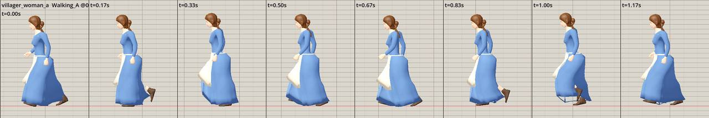
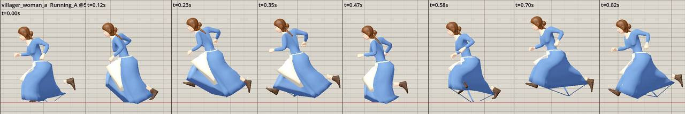
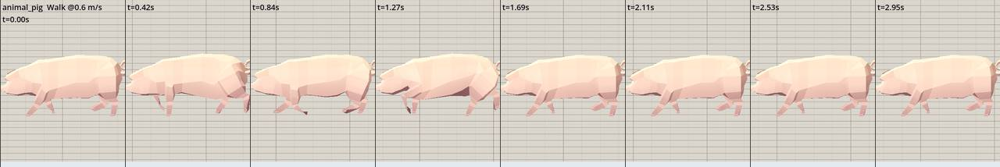

# Rig deformation: visual asset follow-up

Claude handoff using existing game-loader pose strips from the local checkout at `e3563fc4`. These are captured poses, not new animations or repaired assets. Refresh the active animation QA before editing: its armored-boot weight repair is already documented and must be preserved.

## Dress: compare walk and run before changing weights

The walk strip keeps the skirt relatively contained. In the run strip, wide leg separation stretches the lower garment, with thin triangular panels particularly visible around 0.58–0.82 s. This confirms a visible deformation problem in those sampled poses. It does not independently prove the precise weight or topology cause. The current QA report attributes similar defects across women, mother, elder, child-girl, and old-lady rigs to thigh-driven skirt weights.

In Blender, inspect the affected vertices in rest pose and these exact run poses from front, side, and underside. Check face connectivity, accidental internal faces, vertex groups, weight sums, pelvis/thigh distribution, and leg penetration before deciding on a repair. A pelvis-heavy skirt may reduce tenting but can introduce leg-through-cloth artifacts; compare both outcomes. If the garment needs additional deformation bones or different topology, document the rig/import compatibility cost and keep an original copy. Do not substitute a slower walk for all fleeing behavior simply to hide the defect.

Validate walk, run, start/stop, turn, sit, kneel, dodge, hit, and death where gameplay uses them. Compare LOD0 and LOD1 and all affected garment families through the actual Godot loader. A side-view mannequin result cannot approve every profile or an entire garment family.

## Pig: distinguish limb translation from skin weights

The front limb looks elongated in several poses. The QA report identifies front-foot retarget stretch in pig and sheep clips. Inspect rest chain lengths, bone axes, scale/position tracks, helper/IK bone translation, retarget mapping, and weights in Blender; compare the source action and retargeted action at identical normalized times. Removing translation keys blindly can remove intentional motion or break another rig. Preserve approved root motion and repair the identified limb mapping/track only after confirming the cause.

Repeat the walk/run review at the game's scale, with a fixed ground grid and front/side views. Keep clip deformation and playback-speed mismatch as separate measurements. A corrected speed ratio cannot fix an elongated leg, and the existing zero-contact estimates require visual confirmation before computing playback multipliers.

## Acceptance handoff

Provide an original/candidate comparison at the same scale, clip time, camera, and travel speed. Save the affected bone/vertex diagnosis, export settings, source/license, and rig/LOD coverage with any proposed asset. Report maximum limb stretch and floor penetration, then judge silhouette, garment clearance, pose pops, and the same live fleeing/turning action in normal gameplay.

The images copied here are existing project QA evidence. No source rig, clip, mesh, or gameplay alias has been changed. Coordinate candidate asset work with Claude's active animation pass and accept it only after that pass's game-loader checks plus visual review. Related: [speed review](LOCOMOTION_SPEED_REVIEW.md), [start/stop/turn contract](LOCOMOTION_START_STOP_TURN_CONTRACT.md), and [phase/foot-contact prerequisites](LOCOMOTION_PHASE_AND_FOOT_CONTACT_DESIGN.md).
